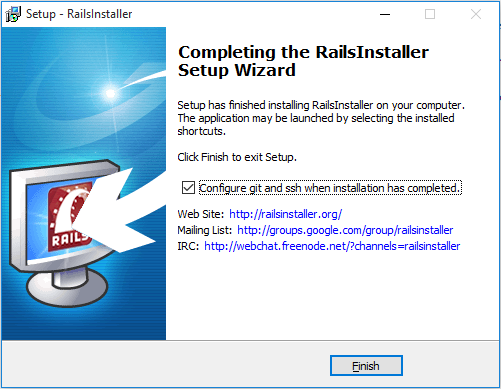
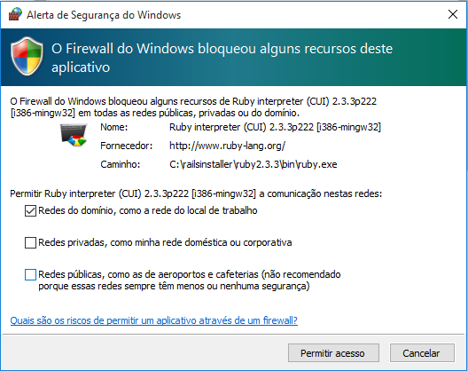
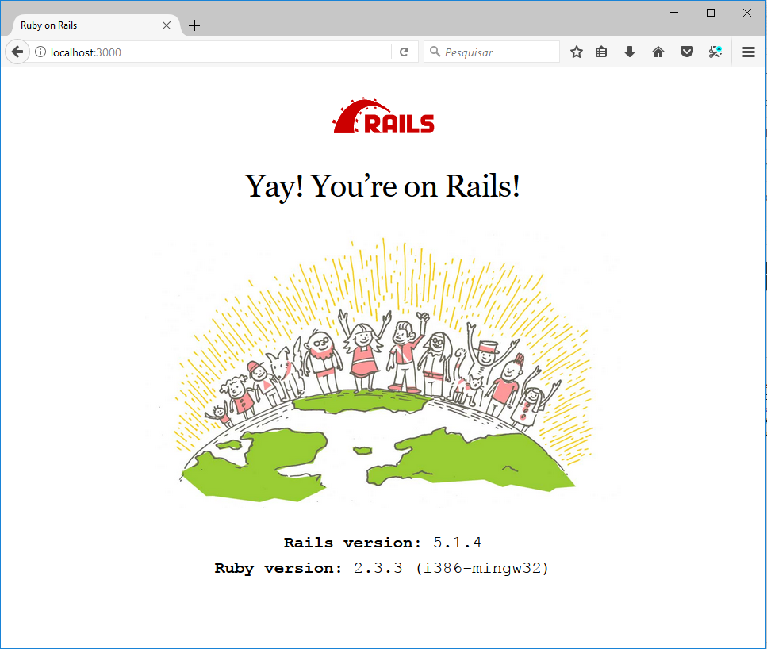

# Instalação

## Windows

Para instalar o Ruby, Git, Bundler e mais algumas coisinhas (de forma simples), eu recomendo o [Rails Installer](http://www.railsinstaller.org/pt-BR).

O setup do Rails Installer é basicamente o "next > next > next" do Windows. Você precisará de aproximadamente 500MB livres em disco para isso.

Após o término da instalação, essa é a telinha de :sucesso::

<p align="center">
  
</p>

Eu recomendo deixar selecionado o checkbox que pede para configurar o Git e o SSH. Se você deixar selecionado, após clicar em concluir, vai abrir um prompt pedindo para configurar seus dados no Git:

```
# Rails Environment Configuration.

Your git configuration is incomplete.
user.name and user.email are required for properly using git and services such
as GitHub (https://github.com/).

 Please enter your name, for example mine is: Wayne E. Seguin
name >
```

Após inserir seu nome e e-mail (que serão as configs utilizadas a cada `$ git commit`, vai ser gerada uma chave SSH e a chave pública será copiada para a sua área de transferência. Agora é só vir no GitHub e [adicionar essa chave nas configs](https://help.github.com/articles/adding-a-new-ssh-key-to-your-github-account/), que você poderá realizar `$ git push` em seus repositórios sem precisar se estressar com configs de acesso :P

Agora para checarmos se a instalação ocorreu bem, utilizaremos esse mesmo prompt para criar e executar um servidor.

```
$ rails new potato
```

(potato é um nome aleatório que eu escolhi para o app)

O `bundle install` será executado e o setup inicial será feito. Agora entre na pasta do projeto e execute o servidor!

```
$ cd potato
$ rails server
```

Dependendo das suas configurações de Firewall, será necessário permitir o acesso do servidor na rede, então talvez apareça uma janelinha assim:

<p align="center">
  
</p>

É só clicar em ok e abrir o seu navegador favorito (de prefêrencia o [Firefox](https://www.mozilla.org/pt-BR/firefox/)) e acessar [localhost:3000](http://localhost:3000/).

<p align="center">

</p>

Os logs no prompt deverão estar mais ou menos assim:

```
$ rails s
=> Booting Puma
=> Rails 5.1.4 application starting in development
=> Run `rails server -h` for more startup options
*** SIGUSR2 not implemented, signal based restart unavailable!
*** SIGUSR1 not implemented, signal based restart unavailable!
*** SIGHUP not implemented, signal based logs reopening unavailable!
Puma starting in single mode...
* Version 3.11.0 (ruby 2.3.3-p222), codename: Love Song
* Min threads: 5, max threads: 5
* Environment: development
* Listening on tcp://0.0.0.0:3000
Use Ctrl-C to stop
Started GET "/" for 127.0.0.1 at 2017-11-25 08:19:44 -0300
Processing by Rails::WelcomeController#index as HTML
  Rendering c:/RailsInstaller/Ruby2.3.3/lib/ruby/gems/2.3.0/gems/railties-5.1.4/lib/rails/templates/rails/welcome/index.html.erb
  Rendered c:/RailsInstaller/Ruby2.3.3/lib/ruby/gems/2.3.0/gems/railties-5.1.4/lib/rails/templates/rails/welcome/index.html.erb (3.0ms)
Completed 200 OK in 151ms (Views: 15.6ms)
```

Isso indica que iniciamos um servidor, ele roda na porta 3000 e que um request do tipo GET foi feito para `/`. Se não estiver assim, deu alguma treta :( nesse caso, recomendo abrir uma issue nesse repositório para que a gente possa discutir e te ajudar a solucionar o problema!

Para conseguirmos utilizar os assets, precisamos [instalar o NodeJS](https://nodejs.org/en/download/). A versão recomendada é a LTS (Long Time Support - vai possuir suporte por mais tempo). - **ISSO NÃO FOI TESTADO AINDA**.

Precisaremos também de um editor de texto! [Atom](https://atom.io/) é sempre uma boa escolha ;)

Agora tudo ok! :tada: Rails já está instalado e configurado na sua máquina ~:D Divirta-se!
