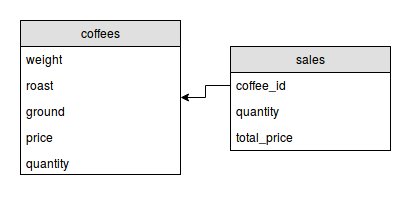

# coffee-shop

O projeto contido neste repositório é para gerenciar o estoque de uma loja de cafés, com as seguintes funcionalidades:

- Listagem do estoque;
- Adicionar um item no estoque;
- Atualizar os dados de um item no estoque;
- Atualizar a quantidade em estoque (uma compra foi realizada, salvamos a compra também);
- Excluir um item do estoque;

Com estas funcionalidades, temos um _CRUD_ (_Create_, _Read_, _Update_, _Delete_), que em _SQL_ é referente as operações _Create_, _Select_, _Update_ e _Delete_ e em _REST_ temos o _GET_, _POST_, _PUT/PATCH_ e _DELETE_.

Diagrama do Banco de Dados:



## Tutorial

### Ruby

Utilize o [TryRuby.org](http://tryruby.org/) para se familiarizar com a sintaxe do Ruby!

### Rails

Rails é um framework escrito em Ruby. Para isso, precisamos ter o Ruby instalado (para Linux/Mac, eu utilizo o RVM; para Windows, tem o [RailsInstaller]()). Após isso, podemos instalar o Rails:

```
$ gem install rails
```

Dependendo da nossa versão do Ruby, o Rails instalado será v4 ou v5. Existem diferenças consideráveis entre as duas, mas isso não irá afeter a nossa aplicação.
Com a gem do Rails instalada, podemos utilizar os comandos `$ rails <alguma coisa>`. Para criar uma aplicação:

```
$ rails new coffee_shop
```

EXECUTAR RAILS SERVER - TEM QUE DAR SUCESSO

Isso irá criar uma pasta com todas as dependências do projeto e irá executar o `bundle install`, esse comando instala todas as *gems* padrões do Rails, que são definidas no arquivo `Gemfile`.

Como temos uma aplicação criada e as gems instaladas, podemos iniciar o servidor e checar se está tudo ok:
```
$ rails server
```

Você pode acessar o servidor acessando [localhost:3000](http://localhost:3000). A criação da estrutura inicial do projeto é um commit LINKAR PARA GIT COMMIT EM PT!

Para isso, criaremos um repositório na pasta do projeto:
```
$ git init
```

Você pode adicionar todos os arquivos e criar um commit chamado "Estrutura inicial" com os seguintes comandos:
```
$ git add .
$ git commit -m "Estrutura inicial"
```

Voltando a falar do projeto, iremos utilizar as configurações padrões, logo, utilizaremos SQLite para gerenciamento do banco de dados - com isso, não iremos nos preocupar em configurar conexão nem instalar o PostgreSQL.

Para iniciar o desenvolvimento da nossa aplicação, iremos criar os modelos (models) que serão abstrações das tabelas no banco de dados. Assim como visto pela modelagem inicial, teremos duas tabelas:
- coffee e - aaaa


```
$ rails generate model coffee size:integer type darkness:
```

Temos vários tipos de dados - MANDAR LINKS DO QUE É EM SQL E O QUE É EM RUBY' - definimos o tipo de cada atributo na criação do modelo.

Obs.: Rails possui muitas configurações que são feitas através de convenções (_Convention Over Configuration_ === CADE LINKS:), por isso iremos construir todos os modelos, controladores etc em inglês, e como o plural em português é bem diferente do jeito que é feito em inglês, as coisas ficariam bem confusas se fizermos em português (e.g. se a gente tiver um modelo "papel" seria criado uma tabela "papels").

A saída desse comando vai ser algo parecido com isso:
```
Running via Spring preloader in process 31198
invoke  active_record
create    db/migrate/20171123121103_create_coffees.rb
create    app/models/coffee.rb
invoke    test_unit
create      test/models/coffee_test.rb
create      test/fixtures/coffees.yml
```

Iremos ignorar o que foi criado na pasta `test`, já que não iremos falar sobre (mas testes são essenciais em uma aplicação, então leia sobre isso!). O que nos interessa agora é o que está em `db/migrate` e em `app/models`.

A migração gerada contem um script do `ActiveRecord` para criar a tabela `coffees` e seus atributos. Esse monte de número no início do nome do arquivo é o _timestamp_ do momento da criação da migração.

O arquivo do modelo (`app/models/coffee.rb`) só contem a definição da classe. É no modelo que iremos - em alguns instantes - definir os relacionamentos e as validações referentes a entidade `coffee`.

Repetiremos os mesmos passos para criar um modelo de `purchase`:

```
$ rails g model purchase coffee_id:integer
```

Agora que temos os modelos criados e definidos, é possível utilizar o _Rails Console_ parar adicionar dados ao banco.

```
$ rails console
```

```
> Coffeee.new
> coffeee.create
> Coffee.create(aaa:aaa:aa:)
```

Para construir (agora de verdade) a aplicação, iremos começar pela definição das rotas. Rotas são basicamente as URLs que permitem que a gente acesse diferentes páginas da aplicação.

As rotas são definidas no arquivo `config/routes.rb`. Como já sabemos que queremos fazer um CRUD para `coffee`, utilizaremos um método chamado `resources`, que nos permite gerar rotas para essas ações, (link para arquivo de rotas). Ao gerar os _resources_ para `coffee`, podemos ver quais são as rotas disponíveis no sistema:

```
$ rake routes
Prefix Verb   URI Pattern                       Controller#Action
coffee_index  GET    /coffee(.:format)          coffee#index
              POST   /coffee(.:format)          coffee#create
new_coffee    GET    /coffee/new(.:format)      coffee#new
edit_coffee   GET    /coffee/:id/edit(.:format) coffee#edit
coffee        GET    /coffee/:id(.:format)      coffee#show
              PATCH  /coffee/:id(.:format)      coffee#update
              PUT    /coffee/:id(.:format)      coffee#update
              DELETE /coffee/:id(.:format)      coffee#destroy
```

Cada linha dessa saída nos indica, respectivamente, qual o método que a gente utiliza para acessar essa rota (e.g. de acordo com a primeira linha, podemos utilizar o método `coffee_index_path` ou `coffee_index_url` para ter ter acesso a URI da listagem de `coffee`), qual o verbo HTTP essa requisição utiliza (mais sobre VERBOS HTTP E ONDE UTILIZAOS, AQUI` e qual ação do _controller_ é utilizada para executar essa ação, nesse caso, teremos um `CoffeesController` com um método `index` que irá processar essa requisição.

Já que temos uma rota para acessar, podemos testá-la! Ao executar o servidor, tente acessar alguma dessas rotas. Vai dar erro, mas é ok porque ainda não existe um _controller_ para processar isso (é sempre bom ver dar erro ao invés de já ir fazendo o que você julga estar faltando, vai dar uma ideia melhor do que está acontecendo).

Para gerar um _controller_, iremos utilizar um comando o rails:
```
$ rails generate controller coffees
Running via Spring preloader in process 31397
create  app/controllers/coffees_controller.rb
invoke  erb
create    app/views/coffees
invoke  test_unit
create    test/controllers/coffees_controller_test.rb
invoke  helper
create    app/helpers/coffees_helper.rb
invoke    test_unit
create      test/helpers/coffees_helper_test.rb
invoke  assets
invoke    coffee
create      app/assets/javascripts/coffees.js.coffee
invoke    scss
create      app/assets/stylesheets/coffees.css.scss
```

Essa é uma boa hora para reiniciar o servidor, já que novos arquivos não são carregados quando o servidor já está rodando. Para isso, pressione `Ctrl+C` na janela do terminal que o processo está sendo executado e execute `$ rails server` novamente.

Assim como o gerador de _models_, foram criados muitos arquivos que não iremos utilizar. Uma opção para evitar isso é criar o _controller_ manualmente (é o que eu - e acho que muita gente - faz no dia-a-dia) ou configurar os geradores para fazer algo mais útil (LINKS).

Iremos (novamente) ignorar os arquivos gerados na pasta `/test`. O conteúdo da pasta `app/assets`, é referente CSS e JS, o padrão do Rails é utilizar CoffeeScript (mas não tenho muita certeza se a comunidade continua utilizando tanto isso) e SASS, por isso vem com essas extensões estranhas, mas não iremos alterar esses arquivos também. O arquivo gerado em `app/helper` é utilizado para colocarmos lógica da _view_ que não queremos que fique no HTML nem no _model_ (que é onde algumas pessoas acabam colocando).

Por hora, iremos mexer no arquivo gerado em `app/controllers` e criaremos arquivos HTML em `app/views/coffee`.

A primeira ação que iremos construir é a de listar. Aproveitaremos os registros criados através do _rails console_ para listar.

Em `app/controllers/coffees_controller.rb', criaremos um método `index` (igual aquele definido nas rotas) e iremos carregar todos os registros salvos no banco:
```ruby
def index
  @coffees = Coffee.all
end
```

Utilizar o método `Coffee.all` é o equivalente a fazer uma consulta no banco. O retorno é uma lista de objetos do tipo `Coffee`.
```
SELECT * FROM coffees;
```

Adicionamos esses registros à uma variável `@coffees`, que possui esse `@` por ser uma variável de instância (LINK PARA VARIAVEL DE INSTANCIA E CLASSE), e conseguimos acessá-la na view.

Por padrão, o Rails irá redirecionar para um arquivo em `app/views/<nome do controller>/<nome da ação>.html.erb`, que no nosso caso é `app/views/coffees/index.html.erb`. A extensão '.erb` SIGNIFICA ALGO AI e conseguimos, através de  QUAL O NOME DISSO? `<%= %>` utilizar Ruby dentro do HTML.

Essa view irá conter uma tabela com todos os registro, como você pode ver [aqui](CAMINHO DO ARQUIVO).

Todas alterações que fizemos na listagem também são conteúdo para mais um commit! Podemos adicionar todos os arquivos e fazer um novo commit com os seguintes comandos:
```
$ git add .
$ git commit -m "Adicionados recursos para listagem dos registros em Coffee"
```

### Adicionando um produto no estoque

Agora que temos a listagem, próximo passo é criar uma forma de adicionarmos novos registros através de um formulário. Como as rotas já estão prontas, iremos direto para o _controller_.

A ação de criação envolve duas etapas:
- abrir uma página com o formulário vazio;
- receber esses dados, persistir no banco e retornar mensagem de sucesso (ou erro) pro usuário.

Para a primeira etapa, criaremos um método `new` no _controller_ e iremos iniciar um objeto `Coffee`.
```
def new
  @coffee = Coffee.new
end
```

Repare que agora temos uma variável `@coffee`, que como armazena apenas um objeto de `Coffee` - ao invés de `@coffees` que armazenava um _array_ -, temos uma variável no singular. Isso irá ajudar na leitura do código, onde uma variável no singular guarda somente um elemento e uma variável no plural guarda um array.

Para criar o formulário, iremos editar o arquivo `app/views/coffees/new.html.erb` e utilizaremos o `form_for` que já vem junto com o Rails. Uma alternativa é utilizar a _gem_ [SimpleForm]().

```
```

explicar aa

Ao clicar no botão de enviar, irá retornar um erro pois o form faz uma requisição para a rota POST (ver mais detalhes disso aaa 0 como explicar::). Isso acontece pois o objeto em `@coffee` ainda não foi persistido - ele não possui um `id` -, caso contrário, a requisição iria para a rota em PUT/PATCH (nao sei qual :P). N"ao ire abordar isso, então fica como lição de casa.

No controller, 
   Temos que tratar os parãmetros recebidos - utilizaremos o Rails Parameter aaa STRONG PARAMS 
   ```
   def coffee_params
   end
   ```

Agora utilizaremos o retorno desse método para criar um novo objeto de `Coffee` e iremos persistir no banco.
```
def create
  @coffee = Coffee.new(coffee_params)

  # o método `save` retorna true/false referente ao objeto ter sido persistido ou não.
  if @coffee.save
    aaaJ
  else
    aaa
  end
end
```


Com isso, temos mais um commit :D mais uma vez:
```
$ git add .
$ git commit -m "Adicionado formulário e acao de persistencia de Coffee"
```

### Atualizar o estoque

A nossa ação de atualizar o estoque irá acontecer ao realizar uma venda ou pela chegada de mercadoria nova. No primeiro caso, iremos registrar as adições como uma venda. Para isso, já temos o _model_ da venda criado, que é o MODEL AAAA NAO SEI O NOME.

O fluxo será:
- abrir página para realizar uma venda;
- atualizar o modelo de `Coffee` e criar um novo registro em VENDA;

mostrar print da telaaa

(sim, sem css. Fica como lição de casa adicionar [Twitter Bootstrap]() ou outra coisa legal)

Para a primeira etapa, iremos criar uma rota para acessarmos `coffees/<id>/purchase`. Voltando ao arquivo `config/routes.rb`, iremos adicionar uma requisição GET a essa URL:
```
resources do
/:id/purchase
end
```

Pela estrutura da rota?? - no controller iremos acessar a key `:id` em `params`.


criar controller
```
def show
  @coffee = Coffee.find(params[:id])
end
```

Iremos carregar essa variável em uma tela que contém todas as informações do produto, junto com um formulário para realizarmos a venda.

SHOW NA VDD:

a página contem todas as infos,
carrega campo de quantidade
salva
sucesso


# todo - nao pode salvar pelo form, quantidades negativas. 


(ver resultado final - mandar links)

Para visualizar esses dados, 


BONUSSSS - UPLOAD DE IMAGEMkkk


Tudo que fizemos aqui pode ser resumido com um `$ rails generate scaffold`, mas é muita mágica e eu não utilizar isso te ajuda entender melhor como as coisas funcionam :)


começaremos pelas rotas. Todas as rotas são definidas no arquivo `config/routes.rb`.


### Outros recursos:

- tutorial rails girls
PERCISO DAR MERGE NO NEGOCIO DO MAUJOR


