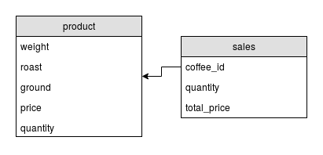

# coffee-shop

O projeto contido neste repositório é um gerenciador o estoque de lojas de café com as seguintes funcionalidades:

- Listagem do estoque;
- Adicionar um item no estoque;
- Atualizar a quantidade em estoque (uma compra foi realizada, salvamos a compra também);
- (todo) Atualizar os dados de um item no estoque;
- (todo) Excluir um item do estoque;

Com estas funcionalidades, temos um **_CRUD_** (_Create_, _Read_, _Update_, _Delete_), que em **_SQL_** é referente as operações _Create_, _Select_, _Update_ e _Delete_ e em **_REST_** temos o _GET_, _POST_, _PUT/PATCH_ e _DELETE_.

Diagrama do Banco de Dados:

<p align="center">
  
</p>

## Tutorial

## Requisitos

**1. Git e GitHub**

Você precisará ter o [Git instalado](https://git-scm.com/book/en/v2/Getting-Started-Installing-Git) em seu sistema operacional para versionar o código deste workshop.

**2. Conhecimento básico em Ruby**

Utilize o [TryRuby.org](http://tryruby.org/) para se familiarizar com a **sintaxe** do Ruby!

**3. Rails**

Rails é um framework escrito em Ruby. Para isso, precisamos ter o Ruby instalado (para Linux/Mac, eu utilizo o [RVM](https://rvm.io/); para Windows, tem o [Rails Installer](http://www.railsinstaller.org/pt-BR)).

Após a instalação do Ruby, podemos instalar o Rails:

```
$ gem install rails
```

Dependendo da nossa versão do _Ruby_, a versão do _Rails_ instalado será 4.x.x ou 5.x.x. Existem diferenças consideráveis entre as duas, mas isso não irá afeter a nossa aplicação.

Com a _gem_ do _Rails_ instalada, podemos utilizar os comandos `$ rails <alguma coisa>`.

Vamos, então, criar nossa aplicação _CoffeeShop_:

```
$ rails new coffee_shop
```

Isso irá criar uma pasta com todas as dependências do projeto e irá executar, automaticamente, o `bundle install`. Esse comando instala todas as *gems* padrões do Rails, que são definidas no arquivo [Gemfile](rails/Gemfile).

Como temos uma aplicação criada e as gems instaladas, podemos entrar na pasta do projeto, iniciar o servidor e checar se está tudo ok:

```
$ cd coffee_shop
$ rails server
```

Você pode acessar o servidor acessando [localhost:3000](http://localhost:3000).

A criação da estrutura inicial do projeto é alteração sufiente para criarmos um [commit](https://git-scm.com/docs/git-commit) (não que exista limite min/máx de alterações necessárias para um commit ¯\_(ツ)_/¯).

Para isso, criaremos um repositório na pasta do projeto:

```
$ git init
```

Você pode adicionar todos os arquivos e criar um commit chamado "Estrutura inicial" com os seguintes comandos:

```
$ git add .
$ git commit -m "Estrutura inicial"
```

Voltando a falar do projeto, iremos utilizar as configurações padrões. Logo, utilizaremos [SQLite](https://www.sqlite.org/) para gerenciamento do banco de dados - com isso, não iremos nos preocupar em configurar conexão nem instalar um PostgreSQL ou MySQL da vida.

Para iniciar o desenvolvimento da nossa aplicação, iremos criar os _models_ que serão abstrações das tabelas no banco de dados.

Assim como visto pela modelagem inicial, teremos as tabelas `products` e `sales`.


```
$ rails generate model product weight:integer roast ground price:float quantity:integer
```

Serão criadas também as colunas `id`, `created_at` e `updated_at`, que são gerenciadas pelo `ActiveRecord` e essas duas últimas no formato de data.

Temos vários tipos de dados, onde definimos o tipo de cada atributo na criação do modelo - quando não especificamos nenhum, o tipo `string` é utilizado.

**Notas:** _Rails_ possui muitas configurações que são feitas através de [convenções](http://rubyonrails.org/doctrine/#convention-over-configuration), por isso iremos construir todas as _models_, _controllers_ etc em inglês. Como o plural em português é bem diferente do jeito que é feito em inglês as coisas ficariam bem confusas se fizéssemos em português (e.g. se tivermos um modelo "papel" teríamos que criar uma tabela chamada "papels").

A saída desse comando vai ser algo parecido com isso:

```
Running via Spring preloader in process 14385
invoke  active_record
create    db/migrate/20171124001336_create_products.rb
create    app/models/product.rb
invoke    test_unit
create      test/models/product_test.rb
create      test/fixtures/products.yml
```

Iremos ignorar o que foi criado na pasta `test`, já que não iremos falar sobre (mas testes são essenciais em uma aplicação, então [leia sobre isso](https://en.wikipedia.org/wiki/Software_testing)!). O que nos interessa agora é o que está em `db/migrate/` e em `app/models/`.

A migração gerada contem um script do `ActiveRecord` para criar a tabela `products` e seus atributos. Esse monte de número no início do nome do arquivo é o _timestamp_ do momento da criação da migração.

O arquivo do model [app/models/product.rb](rails/app/models/product.rb) só contem a definição da classe. É nesse arquivo que iremos - em alguns instantes - definir os relacionamentos e as validações referentes a entidade `product`.

Repetiremos os mesmos passos para criar um modelo de `purchase`:

```
$ rails g model purchase product_id:integer quantity:integer total_price:float
```

Para efetuar essas alterações, utilizaremos uma rake:

```
$ rake db:migrate
```

A execução dessa _rake_ altera o nosso arquivo [db/schema.rb](rails/db/schema.rb). Esse arquivo sempre vai conter um esqueleto da situação atual do banco, então todas as migrações que alteram o banco serão refletidas nesse arquivo.

Agora que temos os modelos criados e definidos, é possível utilizar o _Rails Console_ parar adicionar dados ao banco.

```bash
$ rails console
irb(main):001:0> Product.create(weight: 250, roast: 'dark', ground: 'medium', price: 22, quantity: 200)
  (0.1ms)  begin transaction
  SQL (0.3ms)  INSERT INTO "products" ("weight", "roast", "ground", "price", "quantity", "created_at",
  "updated_at") VALUES (?, ?, ?, ?, ?, ?, ?)  [["weight", 250], ["roast", "dark"], ["ground", "medium"],
  ["price", 22.0], ["quantity", 200], ["created_at", "2017-11-24 00:21:17.081579"], ["updated_at",
  "2017-11-24 00:21:17.081579"]]
  (47.8ms)  commit transaction
=> #<Product id: 1, weight: 250, roast: "dark", ground: "medium", price: 22.0, quantity: 200, created_at:
"2017-11-24 00:21:17", updated_at: "2017-11-24 00:21:17">
```

E todas essas alterações são conteúdo para mais um commit ~:D é bom sempre checar a situação atual utilizando o `git status`.

```
$ git status
On branch master
  Untracked files:
    (use "git add <file>..." to include in what will be committed)

    app/models/product.rb
    app/models/purchase.rb
    db/migrate/
    db/schema.rb
    test/fixtures/products.yml
    test/fixtures/purchases.yml
    test/models/purchase_test.rb

nothing added to commit but untracked files present (use "git add" to track)
$ git add .
$ git commit -m "Adicionados modelos de product e purchase"
```

## Listando do estoque

Para construir (agora de verdade) a aplicação, iremos começar pela definição das rotas. Rotas são basicamente as URLs que permitem que a gente acesse diferentes páginas da aplicação.

As rotas são definidas no arquivo [config/routes.rb](rails/config/routes.rb). Como já sabemos que queremos fazer um CRUD para `product` (que é o café :heart:), utilizaremos um método chamado `resources`, que nos permite gerar rotas para essas ações ([mais sobre rotas no guias do Rails](http://guides.rubyonrails.org/routing.html#resources-on-the-web)). Ao gerar os _resources_ para `product`, podemos ver quais são as rotas disponíveis no sistema:

```
$ rake routes
Prefix        Verb   URI Pattern                  Controller#Action
products      GET    /products(.:format)          products#index
              POST   /products(.:format)          products#create
new_product   GET    /products/new(.:format)      products#new
edit_product  GET    /products/:id/edit(.:format) products#edit
product       GET    /products/:id(.:format)      products#show
              PATCH  /products/:id(.:format)      products#update
              PUT    /products/:id(.:format)      products#update
              DELETE /products/:id(.:format)      products#destroy
```

Cada linha dessa saída nos indica, respectivamente, qual o método que utilizamos para acessar essa rota (e.g. de acordo com a primeira linha, podemos utilizar o método `products_path` ou `products_url` para ter ter acesso a URI da listagem de `products`), qual o verbo HTTP essa requisição utiliza e qual ação do _controller_ é utilizada para executar essa ação. Nesse caso, teremos um `ProductsController` com um método `index` que irá processar essa requisição.

Já que temos uma rota para acessar, podemos testá-la! Ao executar o servidor, tente acessar alguma dessas rotas. Vai dar erro, mas é ok porque ainda não existe um _controller_ para processar isso (é sempre bom ver dar erro ao invés de já ir fazendo o que você julga estar faltando, vai dar uma ideia melhor do que está acontecendo).

Para gerar um _controller_, iremos utilizar um comando o rails:

```
$ rails generate controller products
Running via Spring preloader in process 31397
create  app/controllers/products_controller.rb
invoke  erb
create    app/views/products
invoke  test_unit
create    test/controllers/products_controller_test.rb
invoke  helper
create    app/helpers/products_helper.rb
invoke    test_unit
create      test/helpers/products_helper_test.rb
invoke  assets
invoke    coffee
create      app/assets/javascripts/products.js.coffee
invoke    scss
create      app/assets/stylesheets/products.css.scss
```

Essa é uma boa hora para reiniciar o servidor, já que novos arquivos não são carregados quando o servidor já está rodando. Para isso, pressione `Ctrl+C` na janela do terminal que o processo está sendo executado e execute `$ rails server` novamente.

Assim como o gerador de _models_, foram criados muitos arquivos que não iremos utilizar. Uma opção para evitar isso é criar o _controller_ manualmente (é o que eu - e acho que muita gente - faz no dia-a-dia) ou [configurar os geradores](http://guides.rubyonrails.org/generators.html) para fazer algo mais útil.

Iremos (novamente) ignorar os arquivos gerados na pasta `/test`. O conteúdo da pasta `app/assets`, é referente ao CSS e JS, o padrão do Rails é utilizar CoffeeScript (mas não tenho muita certeza se a comunidade continua utilizando tanto isso) e SASS, por isso vem com essas extensões estranhas, mas também não iremos alterar esses arquivos.

O arquivo gerado em `app/helper` é utilizado para colocarmos lógica da _view_ que não queremos que fique no HTML nem no _model_ (que é onde algumas pessoas acabam colocando).

Por hora, iremos mexer no arquivo gerado em `app/controllers` e criaremos arquivos HTML em `app/views/products`.

A primeira ação que iremos construir é a de listar. Aproveitaremos os registros criados através do _rails console_ para ter algo pra mostrar.

Em [app/controllers/products_controller.rb](rails/app/controllers/products_controller.rb), criaremos um método `index` (igual aquele definido nas rotas) e iremos carregar todos os registros salvos no banco:

```ruby
def index
  @products = Product.all
end
```

Utilizar o método `Product.all` é o equivalente a fazer uma consulta no banco. O retorno é uma lista de objetos do `ActiveRecord` com registros do tipo `Product`.

```sql
SELECT * FROM products;
```

Adicionamos esses registros à uma variável `@products`, que possui esse `@` por ser uma variável de instância ([mais sobre variáveis de classe e instância aqui](https://blog.guilhermegarnier.com/2014/02/variaveis-de-classe-e-de-instancia-de-classe-em-ruby/)) e conseguimos acessá-la na _view_.

Por padrão, depois de processar o _SELECT_, irá redirecionar método para um arquivo em `app/views/<nome do controller>/<nome da ação>.html.erb`, que no nosso caso é [app/views/products/index.html.erb](rails/app/views/products/index.html.erb). Os arquivos HTML com extensão `.erb` (Embedded RuBy) nos permitem utilizar código Ruby dentro do HTML com a ajuda de `<%= %>` ([mais sobre ActionView templates aqui](http://api.rubyonrails.org/classes/ActionView/Base.html)).

Todas alterações que fizemos na listagem também são conteúdo para mais um commit! Podemos adicionar todos os arquivos e fazer um novo commit com os seguintes comandos:
```
$ git add .
$ git commit -m "Adicionados recursos para listagem dos registros em Coffee"
```

Lembre-se de visualizar as suas alterações no browser! Acesse [localhost:3000/products](http://localhost:3000/products) pra ver essa listagem.

## Adicionando um produto no estoque

Agora que temos a listagem, próximo passo é criar uma maneirao do usuário adicionar novos registros através de um formulário. Como as rotas já estão prontas, iremos direto para o _controller_.

A ação de criação envolve duas etapas:

- abrir uma página com o formulário vazio;
- receber esses dados, persistir no banco e retornar mensagem de sucesso (ou erro) pro usuário.

Para a primeira etapa, criaremos um método `new` no _controller_ e iremos iniciar um objeto `Coffee`.

```ruby
def new
  @product = Product.new
end
```

Repare que agora temos uma variável `@product`, que como armazena apenas um objeto de `Product` - ao invés de `@products` que armazenava um _array_ -, temos uma variável no singular. Isso irá ajudar na leitura do código, onde uma variável no singular guarda somente um elemento e uma variável no plural guarda um array (apenas convenção, isso não muda nada pro interpretador).

Para criar o formulário, iremos editar o arquivo [app/views/products/new.html.erb](rails/app/views/products/new.html.erb) e utilizaremos a _gem_ [SimpleForm](https://github.com/plataformatec/simple_form) para poder criar um formulário.

Antes de editar o arquivo, teremos que instalar a gem. Para isso, é só seguir os [passos de instalação que estão no repositório do SimpleForm](https://github.com/plataformatec/simple_form#installation) - e isso já é conteúdo para outro commit.

Voltando ao arquivo, criamos um formulário seguindo os [passos iniciais indicados no repositório](https://github.com/plataformatec/simple_form#usage). **Fica como dever de casa customizar mais esse formulário! Uma coisa legal seria fazer os campos de _ground_ e _roast_ serem um select, já que são especificações pré-definidas (e.g. a torra pode ser clara, média ou escura).**

```ruby
<%= simple_form_for @product do |f| %>
  <%= f.input :weight %>
  <%= f.input :roast %>
  <%= f.input :ground %>
  <%= f.input :price %>
  <%= f.input :quantity %>
  <%= f.button :submit %>
<% end %>
```

Ao clicar no botão de enviar, irá retornar um erro pois o form faz uma requisição para uma rota do tipo **POST** do formulário. Isso acontece pois o objeto em `@product` ainda não foi persistido - ele não possui um `id` -, caso contrário, a requisição iria para a rota em **PUT/PATCH**.

Antes de criar um registro no banco com os dados do formulário, por questões de segurança, iremos utilizar o [strong params](http://edgeguides.rubyonrails.org/action_controller_overview.html#strong-parameters) para validar as keys dos parâmetros, isso impede que atributos mais sensiveis do modelo sejam atualizados. Para isso:

```ruby
def product_params
  params.require(:product).permit(:weight, :roast, :ground, :price, :quantity)
end
```

O retorno desse método é um `Hash`, que conseguimos passar como parâmetros para o `Product.new` ou `Product.create`.

```ruby
def create
  @product = Product.new(product_params)

  # o método `save` retorna true/false referente ao objeto ter sido persistido ou não.
  if @product.save
    # se der tudo ok, a gente redireciona pra listagem. ~lição de casa: adicionar flash messages
    redirect_to products_path
  else
    # irá renderizar o conteúdo de 'new', mas como o objeto `@product` possui coisas em `@product.errors`, algumas mensagens de erro serão renderizadas (mas por enquanto não vai cair aqui porque o model não possui nenhuma validação).
    render :new
  end
end
```


Com isso, temos outro commit ~:D mais uma vez:

```
$ git add .
$ git commit -m "Adicionado formulario e acao de persistencia de Product"
```

## Atualizando o estoque

A nossa ação de atualizar o estoque irá acontecer ao realizar uma venda ou pela chegada de mercadoria nova. No primeiro caso, iremos registrar as adições como uma venda. Para isso, já temos o _model_ da venda criado, que é o `Purchase`.

O fluxo será:

- abrir página para realizar uma venda;
- atualizar o _model_ de `Product` e criar um novo registro em `purchases`;

**Notas.:** quando eu me referir ao _model_, normalmente irei me referir como `Purchase`, por ser a classe que está em [app/models/](rails/app/models/), já quando eu me referir a tabela criada no banco, é `purchases`.

Para a primeira etapa, iremos criar uma rota para acessarmos `products/<id>/purchase`. Voltando ao arquivo [config/routes.rb](rails/config/routes.rb), iremos adicionar uma requisição **GET** a essa URL:

```ruby
resources :products do
  get 'purchase', to: 'purchases#new', as: :new_purchase
end
```

Se você executar `$ rake routes` novamente, verá as configurações dessa nova rota!

Como eu defini que a rota vai pra `purchases#new`, teremos um novo controller, chamado `PurchasesController` que irá receber essas requisições no método `new`. Sabendo que a compra pertence a um produto, teremos sempre que salvar o `:product_id` para persistir junto ao `Purchase`.

Antes de tratar essa requisição, temos que definir o relacionamento entre `Purchase` e `Product`.

Sabemos que um `Product` **possui vários** `Purchase` e um `Purchase` **pertence a** um `Product`. O `ActiveRecord` possui métodos pra gente traduzir isso e adicionar aos _models_. Isso nos dará alguns métodos novos, como `Product#purchases` e `Purchase#product`.

Em [app/models/product.rb](rails/app/models/product.rb):

```ruby
class Product < ApplicationRecord
  has_many :purchases
end
```

E em [app/models/purchase.rb](rails/app/models/purchase.rb):

```ruby
class Purchase < ApplicationRecord
  belongs_to :product
end
```

Agora podemos voltar ao controller! Criaremos o [app/controllers/purchases_controller.rb](rails/app/controllers/purchases_controller.rb) (você pode utilizar o gerador ou criar um arquivo novo, ur call).

Uma diferença em relação ao `ProductsController` é que sempre iremos realizar ações que são de um `Product`, ou seja, sempre precisaremos de um `product_id` em `Purchase`. Para isso, utilizaremos o `:product_id` que vem dos parâmetros e criaremos uma variável de instância no _controller_.

```ruby
def set_product
  @product = Product.find(params[:product_id])
end
```

O método `Product.find` faz a seguinte query:

```sql
SELECT * FROM products WHERE id=<product_id>;
```

Para executar o método `set_product` antes da execução de todos os métodos, adicionamos no começo do arquivo:

```ruby
before_action :set_product
```

Assim, o método `new` ficará do mesmo jeito que fizemos em `ProductsController`.

```ruby
def new
  @purchase = Purchase.new
end
```

A tela dessa ação será um formulário com apenas um campo, quantidade - que não pode ser negativa, afinal, a gente não vende -5 sacos de café. A rota desse formulário iremos definir manualmente, porque por padrão, a rota utilizada seria `purchase_path`, mas como essa rota não existe (vide `$ rake routes`), iremos criar uma e adicioná-la ao formulário.

Em [config/routes.rb](rails/config/routes.rb) (e dentro de `resources :products`):

```ruby
post 'purchase', to: 'purchases#create', as: :create_purchase
```

Em [app/views/purchases/new.html.erb](rails/app/views/purchases/new.html.erb):

```html
<%= simple_form_for @purchase, url: products_create_purchase_path(@product) do |f| %>
  <%= f.input :quantity %>
  <%= f.button :submit %>
<% end %>
```

**Pra acompanhar os erros que deveriam acontecer, crie a rota apenas após tentar criar o formulário sem definir a rota, para ver a mensagem que o Rails retorna.**

No _controller_, criaremos um método de _create_ assim como em `ProductsController`, mas dessa vez, queremos criar um `Purchase` com um `Product` associado. Já que definimos o `@product` no `before_action`, teremos sempre acesso a esse objeto.

```ruby
def create
  @purchase = Purchase.new(purchase_params)
  @purchase.product = @product

  # if save [...]
  # em caso de sucesso, redirecionamos para products_path porque *ainda* não temos outra tela.
end

private

def purchase_params
  params.require(:purchase).permit(:quantity)
end
```

Agora tudo ok :tada:! Conseguimos realizar vendas para cada produto. Rode o servidor (se já não tiver o feito - deveria, na verdade) e teste valores aleatórios e veja se está tudo sendo persistido através do _rails console_.

Só que a ação de venda não ocorre como esperávamos, por dois motivos: conseguimos vender produtos com quantidades negativas e o nosso estoque não está sendo atualizado.

Adicionamos a validação no _model_ de `Purchases` ([app/models/purchase.rb](rails/app/models/purchase.rb)):

```ruby
validates :quantity, numericality: { only_integer: true, greater_than: 0 }
```

[Mais sobre validações no guia do Rails](http://edgeguides.rubyonrails.org/active_record_validations.html).

Para persistirmos de maneira correta o `Purchase`, iremos alterar o _controller_ para fazer todas as ações (o certo seria fazer em um _service_ ou afins).

```ruby
def create
  @purchase = Purchase.new(purchase_params)
  @purchase.product = @product
  @purchase.total_price = (@product.price * @purchase.quantity)

  @product.quantity = (@product.quantity - @purchase.quantity)
  @product.save

  if @purchase.save
    redirect_to products_path
  else
    render :new
  end
end
```

**Outra lição de casa: conseguimos salvar o Product com quantidades negativas, é uma boa adicionar essa validação também! Você fazer um `before_save` no model `Purchase` pra validar se a quantidade em `Product` é maior ou igual a quantidade que você deseja salvar, se não, adiciona o erro em `Purchase#quantity` avisando que essa quantidade é inválida ([mais detalhes em ActiveModel::Errors#add](http://api.rubyonrails.org/classes/ActiveModel/Errors.html#method-i-add)).**

## TODO:
- ProductsController#show (com listagem de Product#purchases);
- ProductsController#delete (excluindo também todos os Product#purchases).
- BONUSSSS - UPLOAD DE IMAGEM


Muito do que fizemos aqui pode ser resumido com um `$ rails generate scaffold`, mas é muita mágica e eu não utilizar isso te ajuda entender melhor como as coisas funcionam :)

## Outros recursos:

- [Tutorial do Rails Girls - em pt!](http://guides.railsgirls.com/guides-ptbr/)

